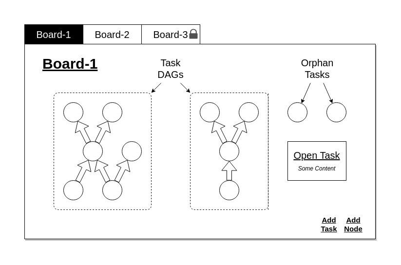

# Graphical Tasks

This project is a task manager with improved visualization for dependence between tasks. Currently this repo only contains some ideation and practically no usable code. 

## Expected Outcome

Following picture describes tentantively how the 

## Object Classes

Following are some classes I can think of at this stage:

1. Task (obviously)
2. Dependency - this should be class as it enable many interesting manipulations.
3. DAG - collection of connected tasks and dependencies
4. WorkBoard - model for the container class, represents broader class of objects, should map to project ideally.

## Choice of Frameworks

I'm thinking to develop this as a web application. I want to try using [tornado](https://www.tornadoweb.org/en/stable/) for backend as it will help me to get acquainted with python `asyncio`. For the graph library, [cytoscape](http://js.cytoscape.org/) looks like a popular choice. Developing the app as reactjs Component would be good.
